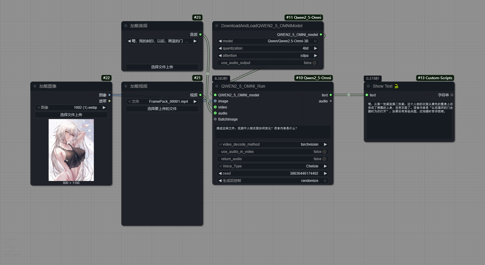
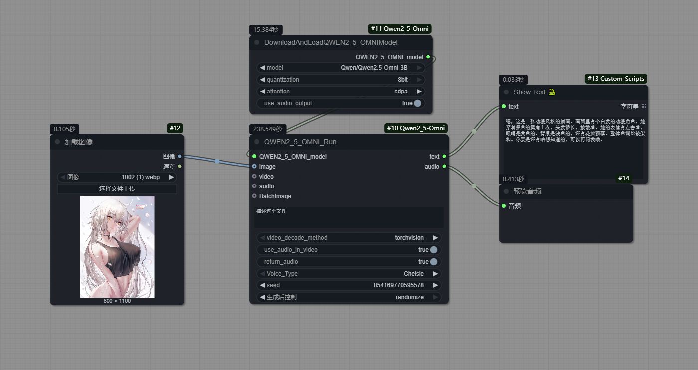
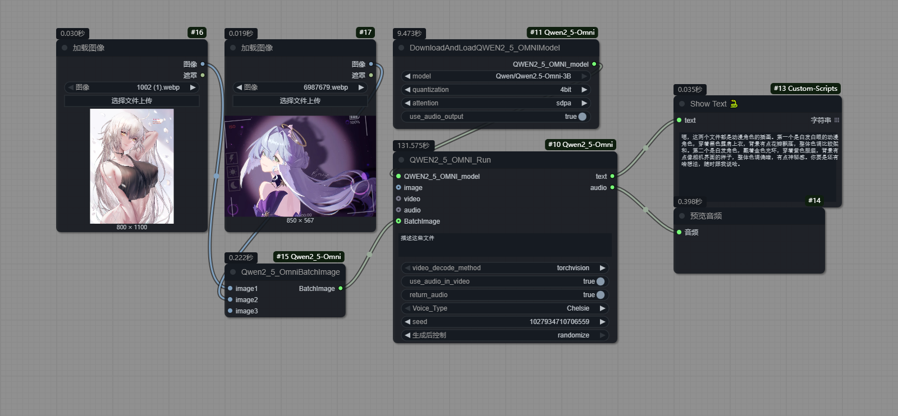
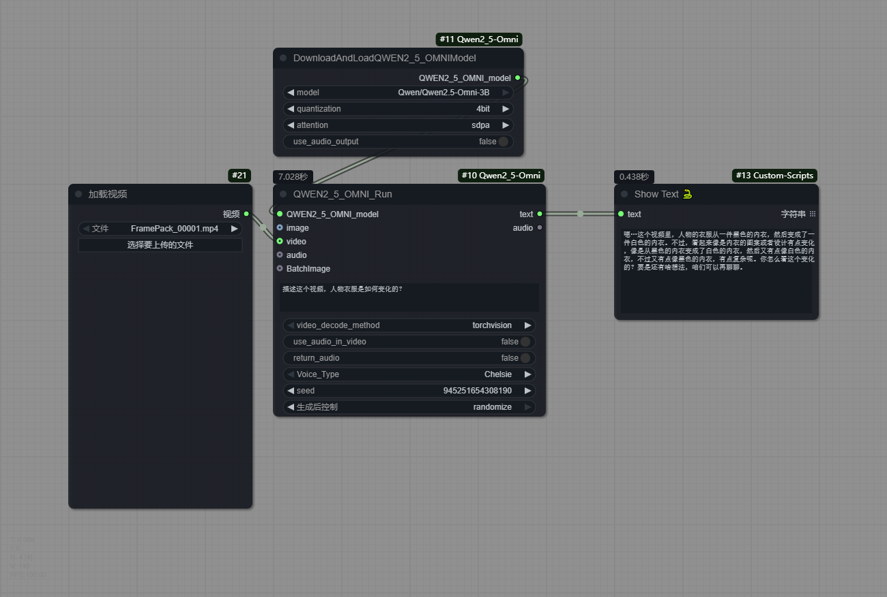
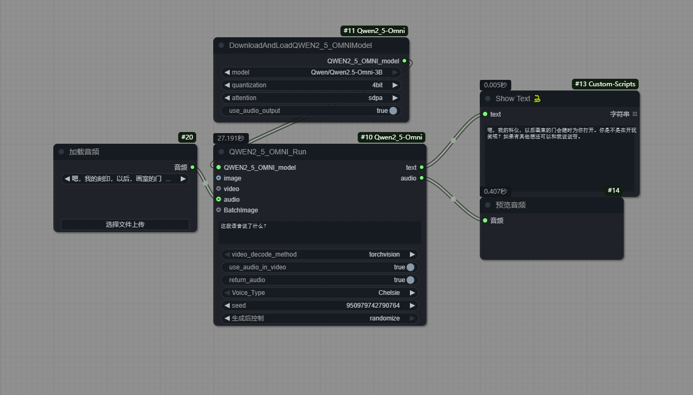

# Qwen2.5-Omni in ComfyUI

[License: Apache License 2.0](https://github.com/QwenLM/Qwen2.5-Omni/blob/main/LICENSE) from **[Qwen2.5-Omni](https://github.com/QwenLM/Qwen2.5-Omni)**

<p align="center">
    
<p>

Qwen2.5-Omni, the new flagship end-to-end multimodal model in the Qwen series. Designed for comprehensive multimodal perception, it seamlessly processes diverse inputs including text, images, audio, and video, while delivering real-time streaming responses through both text generation and natural speech synthesis.

WIP: `4-bit quantized Qwen2.5-Omni-7B (GPTQ-Int4/AWQ)` support

Supports Type:

- Image
- Multi image
- Video
- Audio
- Text only
- Mixed type

Please refer to the following example image:











## Installation:

Clone this repository to 'ComfyUI/custom_nodes` folder.

Install the dependencies in requirements.txt, transformers version 4.52.3 minimum is required:

`pip install -r requirements.txt`

or if you use portable (run this in ComfyUI_windows_portable -folder):

`python_embeded\python.exe -m pip install -r ComfyUI\custom_nodes\ComfyUI-Qwen2_5-Omni\requirements.txt`

Supports most Qwen2_5-Omni models, which can be automatically downloaded with the `DownloadAndLoadQWEN2_5_OMNIModel` to `ComfyUI/models/VLM`:

```
"Qwen/Qwen2.5-Omni-7B",
"Qwen/Qwen2.5-Omni-3B",
```

node name：

- Qwen2_5-Omni/DownloadAndLoadQWEN2_5_OMNIModel
- Qwen2_5-Omni/QWEN2_5_OMNI_Run
- Qwen2_5-Omni/Qwen2_5_OmniBatchImage

## Citation

```BibTeX

@article{Qwen2.5-Omni,
  title={Qwen2.5-Omni Technical Report},
  author={Jin Xu, Zhifang Guo, Jinzheng He, Hangrui Hu, Ting He, Shuai Bai, Keqin Chen, Jialin Wang, Yang Fan, Kai Dang, Bin Zhang, Xiong Wang, Yunfei Chu, Junyang Lin},
  journal={arXiv preprint arXiv:2503.20215},
  year={2025}
}
```

<br>
